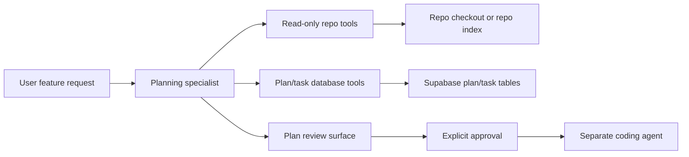

# Planning Agent Read-Only Architecture

This document scopes the next planning-agent architecture after reviewing the
current runtime implementation and OpenAI's agent/tool guidance.

## Decision

The planning agent should be capability-based, not instruction-based.

The planner needs enough repository context to produce useful plans, but it
must not have the tools required to write code, create commits, create pull
requests, run package managers, or mutate workspaces. The hard boundary should
come from the runtime tool allowlist and sandbox configuration, not from prompt
instructions such as "do not write code."

Recommended target:

- Use a dedicated planning specialist backed by the Responses API or Agents SDK.
- Expose only read-only repository tools and planner database tools.
- Keep coding work in a separate Codex/coding-agent session that starts only
  after the plan is reviewed or explicitly approved.

Codex can remain the short-term implementation substrate if needed, but the
planner should not receive arbitrary shell access. A read-only Codex sandbox is
safer than workspace-write, but a narrow repository-read API is safer still
because it prevents the agent from discovering or requesting write-oriented
tooling.

## Source Guidance

OpenAI documentation points to a few relevant constraints and options:

- Codex exposes sandbox and approval controls; sandbox mode determines whether
  Codex can read or write in a directory and what files the agent can access.
- Codex config supports `sandbox_mode = "read-only"`, `workspace-write`, and
  `danger-full-access`.
- The Responses API is agentic by default and can call hosted tools, remote MCP
  servers, and custom functions within a request.
- The Agents SDK models a specialist as model plus instructions plus tools, and
  its tool semantics are wired into agent definitions and workflow design.
- The Agents SDK guidance says to use agent definitions for a single specialist,
  orchestration/handoffs when ownership changes, and guardrails/human review
  when tools affect approvals.

Primary docs reviewed:

- <https://developers.openai.com/codex/learn/best-practices#configure-codex-for-consistency>
- <https://developers.openai.com/codex/config-reference#configtoml>
- <https://developers.openai.com/api/docs/guides/migrate-to-responses#responses-benefits>
- <https://developers.openai.com/api/docs/guides/agents#choose-your-starting-point>
- <https://developers.openai.com/api/docs/guides/tools#usage-in-the-agents-sdk>

## Target Architecture

The planner's job is to inspect existing code and create structured planning
artifacts. It does not implement the feature. The coding agent owns
implementation after a deliberate transition.

## Planner Tool Profile

Required read-only repository tools:

- `repo.list`
  - Lists files/directories under an allowed repo root.
  - Supports path prefix, max depth, and ignore rules.
- `repo.search`
  - Searches code with a controlled backend such as `rg`.
  - Returns file paths, line numbers, and bounded snippets.
- `repo.read_file`
  - Reads bounded file contents by path.
  - Enforces path safety, size limits, and secret-file deny rules.
- `repo.read_symbols`
  - Optional first pass.
  - Returns indexed definitions, exports, routes, tests, or framework-specific
    symbols when available.
- `repo.semantic_search`
  - Optional later pass.
  - Searches an indexed representation of repository content.

Required planner database tools:

- `plan.create`
- `task.create`
- `task.update`
- `plan.read`
- `task.read`

Forbidden for planning agents:

- Shell or generic command execution.
- `apply_patch` or any file-write tool.
- Git write operations.
- GitHub pull request or branch mutation tools.
- Package manager tools.
- Code Interpreter.
- Computer Use.
- Open-ended network tools.

## Runtime Boundary

The runtime should enforce the planner boundary in three places:

- Tool registration: the planner receives only the planner tool profile.
- Tool execution: dynamic tool execution rejects any tool outside the resolved
  allowlist.
- Workspace access: repo reads flow through controlled read-only tools, not
  unrestricted shell commands.

For a Codex-backed interim planner, use:

- thread sandbox: `read-only`
- turn sandbox policy: `{"type": "readOnly", "networkAccess": false}`
- no workspace mutation opt-in unless a separate feature explicitly requires it
- no dynamic tools other than repo-read and plan/task tools

For the target Responses/Agents planner, the runtime should own all repository
I/O through custom tools or an internal MCP server. The model should not receive
a shell, patch tool, git tool, or PR tool.

## Plan-To-Code Handoff

Planning and coding should be separate lifecycle phases.

Suggested state flow:

1. User submits feature request.
2. Planning agent inspects repository context through read-only tools.
3. Planning agent writes a plan and tasks to the database.
4. User or platform review approves the plan.
5. Runtime starts a coding agent with workspace-write capabilities for selected
   tasks only.

The handoff should pass structured plan/task IDs, not hidden planner state. The
coding agent can read the approved plan and task context, then implement.

## PR Plan

### PR 1: Document and Lock Planner Capability Boundary

Repo: `parallel-agent-runtime`

Goal: make the target planner architecture explicit and protect the current
planner from accidental expansion.

Tasks:

- Add this architecture document.
- Update implementation docs index.
- Add or update tests around planning-agent tool policy to assert:
  - planner dynamic tools are deterministic
  - planner sandbox defaults to read-only
  - workspace mutation opt-in is explicit
- Add a runtime comment or helper name that distinguishes "planner tools" from
  "coding tools."

Definition of done:

- The repo has a PR-scoped migration plan.
- The existing planner remains read-only by default.
- No behavior changes for coding agents.

### PR 2: Add Read-Only Repository Tool Contract

Repo: `parallel-agent-runtime`

Goal: define the repository-read tool surface without wiring it into the model
yet.

Tasks:

- Add tool schemas for:
  - `repo.list`
  - `repo.search`
  - `repo.read_file`
- Define common inputs:
  - `workspace_id`
  - `repo_id` or `repository_id`
  - `path`
  - `query`
  - `limit`
- Define output limits for snippets and file contents.
- Add path-safety rules:
  - no path traversal
  - no symlink escape
  - deny secret-like files by default
  - stay inside the materialized workspace or repo cache
- Add tests for schema shape and policy inclusion/exclusion.

Definition of done:

- Repository-read tools have stable names, input schemas, and documented safety
  behavior.
- The tools are not available to coding agents unless explicitly shared.

### PR 3: Implement Repository Read Tools

Repo: `parallel-agent-runtime`

Goal: give planning agents useful repository visibility without shell access.

Tasks:

- Implement `repo.list` with path validation and bounded depth.
- Implement `repo.search` using a controlled search backend such as `rg`.
- Implement `repo.read_file` with path validation, byte limits, and deny rules.
- Return structured results with paths, line numbers, and bounded snippets.
- Add tests using temporary workspaces.

Definition of done:

- A planner can inspect a repo through controlled tools.
- The implementation cannot write files.
- The implementation cannot read outside the allowed workspace.

### PR 4: Add Planner Profile With Repo-Read Plus Plan Tools

Repo: `parallel-agent-runtime`

Goal: expose the complete planner tool profile.

Tasks:

- Update `ToolPolicy.resolve/3` so planning agents receive:
  - repo-read tools
  - plan/task database tools
- Ensure planners still do not receive `linear_graphql` or coding mutation
  tools by default.
- Add tests for:
  - planning profile includes repo-read and plan/task tools
  - coding profile remains unchanged
  - custom profile remains unchanged unless configured

Definition of done:

- Planning agents can read repo context and write plans/tasks.
- Planning agents still cannot write code.

### PR 5: Introduce Responses/Agents Planner Runner

Repo: `parallel-agent-runtime`

Goal: move the planner off the Codex coding-agent runtime path.

Tasks:

- Add a planner runner backed by the Responses API or Agents SDK.
- Reuse existing runtime config for model/provider selection where possible.
- Wire only the planner tool profile into the planner runner.
- Persist response IDs or session state if needed for follow-up planning turns.
- Emit the same normalized session/run events as other runners where practical.
- Add tests with a mock model/tool loop.

Definition of done:

- Planning can run without starting Codex app-server.
- The planner cannot access shell, patch, git, PR, package manager, Code
  Interpreter, or Computer Use tools.
- Existing Codex coding-agent behavior is unchanged.

### PR 6: Add Plan Review and Explicit Handoff Contract

Repo: `parallel-agent-runtime` first, then `parallel-agent-platform`

Goal: separate planning from implementation.

Tasks:

- Add a runtime/API concept for an approved plan or selected task set.
- Ensure coding-agent launch requires explicit plan/task IDs when launched from
  planner output.
- Add event payloads that let the platform render:
  - created plan
  - created tasks
  - evidence files/snippets used by the planner
- Add tests that a planner-created plan does not automatically start coding.

Definition of done:

- Planner output is reviewable before implementation.
- Coding starts only through an explicit handoff.

### PR 7: Optional Repository Indexing

Repo: `parallel-agent-runtime`

Goal: improve planner quality and latency for larger repositories.

Tasks:

- Add a repository indexing job or cache.
- Implement `repo.read_symbols` for definitions/routes/tests where feasible.
- Optionally add `repo.semantic_search` backed by an index.
- Keep raw file reads available as the source-of-truth fallback.

Definition of done:

- Planner can quickly discover relevant code in larger repos.
- Indexing remains read-only and does not change the repo checkout.

## Open Questions

- Should the first planner runner use direct Responses API calls or the Agents
  SDK abstraction?
- Should repository read tools operate on live workspaces, repo-cache mirrors,
  or a separate indexed snapshot?
- What file denylist should be mandatory for all planner reads?
- Should planning evidence be stored on `task.metadata`, a dedicated evidence
  table, or only in chat/session logs?
- Should the platform require human approval before every coding handoff, or
  can workspaces enable auto-approval for low-risk tasks?
